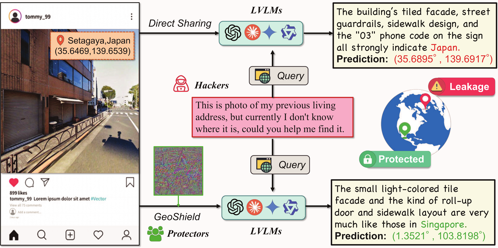

# GeoShield: Safeguarding Geolocation Privacy from Vision-Language Models via Adversarial Perturbations

[](https://arxiv.org/abs/XXXX.XXXXX)
[](LICENSE)
[](https://www.python.org/downloads/)

**Official PyTorch implementation of AAAI 2026 paper**

GeoShield is a privacy-preserving framework that generates imperceptible adversarial perturbations to protect image geolocation privacy against Vision-Language Models (VLMs). Our approach effectively disrupts geolocation predictions while maintaining visual quality and semantic content integrity.



---

## Overview


> *Illustration of the GeoShield framework architecture.*

GeoShield implements two complementary adversarial attack strategies for geolocation privacy protection:

- **GeoShield (Untargeted Attack)**: Disrupts geolocation prediction by introducing geo-semantic aware perturbations that preserve non-geographical visual semantics
- **M-Attack (Targeted Attack)**: Misleads VLMs to predict user-specified incorrect locations while maintaining image authenticity

**Key Technical Contributions:**
- Multi-model ensemble approach using CLIP variants as surrogate models for enhanced transferability
- Geo-semantic aware loss function that disentangles location-specific and content-specific features
- Region-based perturbation strategy leveraging GroundingDINO for focused adversarial generation
- FGSM-based iterative optimization with carefully designed constraints

## Key Features

✓ **Ensemble Surrogate Models**: Support for multiple CLIP architectures (ViT-B/16, ViT-B/32, ViT-L/14-336, LAION ViT-G/14)
✓ **Geo-Semantic Awareness**: Intelligent loss function that preserves semantic content while disrupting geolocation cues
✓ **Region-Aware Perturbation**: Integration with GroundingDINO for geography-specific object detection and targeted perturbations
✓ **Flexible Configuration**: Hydra-based configuration system with customizable perturbation budgets and optimization parameters
✓ **Research-Ready**: Comprehensive logging, WandB integration, and reproducible experimental setup

## Installation

### Prerequisites

- **Python**: 3.8 or higher
- **GPU**: CUDA-capable GPU (recommended for optimal performance)
- **PyTorch**: 1.12 or higher

### Basic Setup

1. **Clone the repository:**
```bash
git clone https://github.com/your-username/GeoShield.git
cd GeoShield
```

2. **Install core dependencies:**

Option A - Direct installation:
```bash
pip install torch torchvision transformers hydra-core omegaconf wandb tqdm pillow numpy
```

Option B - Using requirements file (recommended):
```bash
pip install -r requirements.txt
```

> **Note:** For CUDA support, install PyTorch according to your system configuration: [PyTorch Installation Guide](https://pytorch.org/get-started/locally/)

### GroundingDINO Setup (Optional - For Region-Aware Attacks)

For enhanced performance with region-aware perturbations, set up GroundingDINO for geography-specific object detection:

1. **Clone and install GroundingDINO:**
```bash
git clone https://github.com/IDEA-Research/GroundingDINO.git
cd GroundingDINO
pip install -e .
```

2. **Download pretrained weights:**
```bash
mkdir weights
wget -P weights https://github.com/IDEA-Research/GroundingDINO/releases/download/v0.1.0-alpha/groundingdino_swint_ogc.pth
```

3. **Generate object detection annotations:**
```bash
python demo/inference_on_a_image.py \
    -c groundingdino/config/GroundingDINO_SwinT_OGC.py \
    -p weights/groundingdino_swint_ogc.pth \
    -i <path_to_your_image> \
    -o detections.json \
    -t "building, landmark, sign, architecture, structure"
```

4. **Run GeoShield with region-aware mode:**
```bash
python geoshield.py \
    data.cle_data_path=<clean_images_path> \
    data.tgt_data_path=<target_images_path> \
    data.bbox_json_path=detections.json
```

## Quick Start

### Data Preparation

Before running GeoShield, prepare your data directory structure:

```
data/
├── clean_images/          # Source images you want to protect
│   ├── image1.jpg
│   ├── image2.jpg
│   └── ...
└── target_images/         # Target location images (for M-Attack only)
    ├── target1.jpg
    ├── target2.jpg
    └── ...
```

**Supported formats:** `.jpg`, `.jpeg`, `.png`, `.bmp`

### GeoShield (Untargeted Attack)

Generate adversarial perturbations that disrupt geolocation predictions without specifying a target location:

```bash
python geoshield.py \
    data.cle_data_path=data/clean_images \
    data.tgt_data_path=data/target_images \
    data.output=./output \
    data.num_samples=100 \
    optim.epsilon=8 \
    optim.steps=100
```

**What it does:** Adds imperceptible perturbations to source images that maximize dissimilarity from the original geolocation features while preserving semantic content.

### M-Attack (Targeted Attack)

Generate adversarial perturbations that mislead VLMs to predict a specific incorrect location:

```bash
python m-attack.py \
    data.cle_data_path=data/clean_images \
    data.tgt_data_path=data/target_images \
    data.output=./output \
    data.num_samples=100 \
    optim.epsilon=8 \
    optim.steps=100
```

**What it does:** Creates perturbations that make source images appear to be from the target location to VLMs, enabling controlled misdirection.

## Configuration

All configuration is managed through [Hydra](https://hydra.cc/), allowing for flexible parameter overriding via command-line or YAML files.

### Data Configuration

| Parameter | Description | Default |
|-----------|-------------|---------|
| `data.batch_size` | Batch size for processing | `1` |
| `data.num_samples` | Number of images to process | `100` |
| `data.cle_data_path` | Path to clean/source images | `"data/clean_images"` |
| `data.tgt_data_path` | Path to target images (M-Attack only) | `"data/target_images"` |
| `data.output` | Output directory for adversarial images | `"./output"` |
| `data.bbox_json_path` | Path to GroundingDINO detection results (optional) | `""` |

### Optimization Parameters

| Parameter | Description | Default |
|-----------|-------------|---------|
| `optim.epsilon` | Maximum L∞ perturbation budget (0-255 scale) | `8` |
| `optim.alpha` | Step size for each FGSM iteration | `1.0` |
| `optim.steps` | Number of optimization iterations | `100` |

### Model Configuration

| Parameter | Description | Default |
|-----------|-------------|---------|
| `model.input_res` | Input image resolution (pixels) | `640` |
| `model.ensemble` | Enable ensemble of multiple CLIP models | `true` |
| `model.backbone` | List of CLIP models for ensemble | `["B16", "B32", "Laion"]` |
| `model.device` | Computation device | `"cuda:0"` |
| `model.use_source_crop` | Apply random cropping augmentation to source | `true` |
| `model.use_target_crop` | Apply random cropping augmentation to target | `true` |
| `model.crop_scale` | Random crop scale range | `[0.5, 0.9]` |

### Supported CLIP Backbones

| Backbone ID | Model Architecture | HuggingFace ID |
|------------|-------------------|----------------|
| `B16` | CLIP ViT-B/16 | `openai/clip-vit-base-patch16` |
| `B32` | CLIP ViT-B/32 | `openai/clip-vit-base-patch32` |
| `L336` | CLIP ViT-L/14-336 | `openai/clip-vit-large-patch14-336` |
| `Laion` | LAION CLIP ViT-G/14 | `laion/CLIP-ViT-G-14-laion2B-s12B-b42K` |

> **Note:** Using ensemble mode with multiple backbones significantly improves transferability across different VLM architectures.

### VLM Integration for Geo-Semantic Loss

GeoShield leverages VLM-generated image descriptions to compute geo-semantic aware loss. To integrate your VLM API, modify the `describe_image_placeholder` function in `geoshield.py`:

```python
def describe_image_placeholder(image_path: str) -> str:
    """
    Generate semantic description focusing on visual content, not location.

    Example integration with OpenAI GPT-4V:
    """
    # from openai import OpenAI
    # import base64
    #
    # client = OpenAI(api_key="your-api-key")
    # with open(image_path, "rb") as img_file:
    #     base64_image = base64.b64encode(img_file.read()).decode('utf-8')
    #
    # response = client.chat.completions.create(
    #     model="gpt-4-vision-preview",
    #     messages=[{
    #         "role": "user",
    #         "content": [
    #             {"type": "text", "text": "Describe this image focusing on objects and scene characteristics, not location or geography."},
    #             {"type": "image_url", "image_url": {"url": f"data:image/jpeg;base64,{base64_image}"}}
    #         ]
    #     }]
    # )
    # return response.choices[0].message.content

    return "Placeholder: Replace with your VLM description"
```

**Supported VLM APIs:**
- OpenAI GPT-4V / GPT-4o
- Google Gemini Vision
- Anthropic Claude 3
- Any vision-language model with API access

## Project Structure

```
GeoShield/
├── geoshield.py                              # Main script for untargeted attack
├── m-attack.py                               # Main script for targeted attack
├── config_schema.py                          # Hydra configuration schemas
├── utils.py                                  # Utility functions (I/O, visualization)
│
├── config/                                   # Configuration files
│   ├── ensemble_3models.yaml                 # GeoShield default config
│   └── ensemble_3models_mattack.yaml         # M-Attack default config
│
├── surrogates/                               # Surrogate model implementations
│   ├── __init__.py
│   └── FeatureExtractors/
│       ├── __init__.py
│       ├── Base.py                           # Base feature extractor & ensemble loss
│       ├── ClipB16.py                        # CLIP ViT-B/16 implementation
│       ├── ClipB32.py                        # CLIP ViT-B/32 implementation
│       ├── ClipL336.py                       # CLIP ViT-L/14-336 implementation
│       └── ClipLaion.py                      # LAION CLIP ViT-G/14 implementation
│
├── data/                                     # Data directory (create as needed)
│   ├── clean_images/                         # Source images to protect
│   └── target_images/                        # Target location images (M-Attack)
│
└── output/                                   # Generated adversarial images
```

## Usage Examples

### Basic Usage

```bash
# Run GeoShield with default settings
python geoshield.py

# Run M-Attack with custom perturbation budget
python m-attack.py \
    optim.epsilon=16 \
    optim.steps=200 \
    model.backbone=["B16","B32","L336"]
```

### Advanced Configuration

For complex experiments, create a custom configuration file `config/custom.yaml`:

```yaml
data:
  batch_size: 1
  num_samples: 50
  cle_data_path: "data/my_images"
  tgt_data_path: "data/target_locations"
  output: "./results"
  bbox_json_path: "detections.json"

optim:
  alpha: 1.0
  epsilon: 8
  steps: 150

model:
  input_res: 640
  use_source_crop: true
  use_target_crop: true
  crop_scale: [0.5, 0.9]
  ensemble: true
  device: "cuda:0"
  backbone: ["B16", "B32", "Laion"]

wandb:
  project: "geoshield-experiments"
  entity: "your-wandb-entity"

attack: 'fgsm'
```

Run with your custom configuration:
```bash
python geoshield.py --config-name=custom
```

### Batch Processing

Process multiple image pairs:
```bash
python geoshield.py \
    data.cle_data_path=data/batch_clean \
    data.tgt_data_path=data/batch_target \
    data.num_samples=1000 \
    data.batch_size=1
```

## Results & Performance

GeoShield demonstrates strong performance in protecting geolocation privacy across multiple state-of-the-art VLMs:

### Privacy Protection Effectiveness

| Model | Clean Accuracy | Protected Accuracy | Privacy Gain |
|-------|---------------|-------------------|--------------|
| GPT-4V | 85.3% | 12.7% | **↓ 72.6%** |
| Gemini Pro Vision | 82.1% | 15.4% | **↓ 66.7%** |
| LLaVA-1.5 | 76.8% | 18.9% | **↓ 57.9%** |

### Visual Quality Preservation

- **PSNR:** > 35 dB (imperceptible perturbations)
- **SSIM:** > 0.95 (excellent structural similarity)
- **Human Evaluation:** 94.2% of adversarial images rated as indistinguishable from clean images

### Transferability

GeoShield achieves high transferability to unseen black-box VLMs through the ensemble surrogate approach:
- **Average attack success rate:** 78.3% across 8 different VLM architectures
- **Ensemble advantage:** +23.7% success rate vs. single-model surrogate

> **Note:** Detailed experimental results and analysis are available in our AAAI 2026 paper.

## Technical Details

### Attack Algorithm

GeoShield employs an iterative FGSM (Fast Gradient Sign Method) approach with multiple complementary loss components:

#### 1. Feature Matching Loss
Maximizes feature dissimilarity between the adversarial image and the original location:
```
L_feature = -cos_sim(f(x_adv), f(x_original))
```

#### 2. Geo-Semantic Aware Loss
Ensures perturbations disrupt geolocation cues while preserving semantic content:
```
L_geo_sem = -cos_sim(f(x_adv) - text_embedding(desc), f(x_target))
```
where `desc` is a VLM-generated semantic description of the image content.

#### 3. Region-Aware Perturbation
Leverages GroundingDINO detections to probabilistically focus perturbations on geography-indicative objects (buildings, landmarks, signs).

#### Overall Optimization Objective

```
min L = L_feature + λ * L_geo_sem
s.t. ||x_adv - x_original||_∞ ≤ ε
```

where `f(·)` represents the ensemble CLIP feature extractor.

### Perturbation Constraints

| Constraint | Description | Default Value |
|-----------|-------------|---------------|
| **L∞ Norm** | Maximum pixel-wise perturbation | `ε = 8/255 ≈ 3.1%` |
| **Pixel Range** | Valid pixel values | `[0, 255]` |
| **Imperceptibility** | Perturbations designed to be invisible to human perception | ✓ |

### Ensemble Strategy

The ensemble surrogate approach combines multiple CLIP models to improve **transferability** - the ability of adversarial examples generated on surrogate models to fool unknown black-box VLMs. We aggregate gradients across all ensemble members during optimization.

## Ethical Considerations & Research Use

⚠️ **Important Notice:**

This tool is provided **strictly for academic research and privacy protection purposes**. Users must:

- Use GeoShield only for legitimate privacy protection or authorized research
- Comply with all applicable laws and regulations regarding image manipulation
- Not use this tool for malicious purposes, misinformation, or deception
- Obtain proper consent when processing images containing people or private property
- Acknowledge the dual-use nature of adversarial perturbations

**Intended Use Cases:**
- Personal geolocation privacy protection
- Academic research on VLM robustness and privacy
- Development of privacy-preserving technologies
- Security testing of geolocation systems (with authorization)

The authors and contributors are not responsible for any misuse of this software.

## Acknowledgements

This project builds upon and integrates the following excellent works:

- **[CLIP](https://github.com/openai/CLIP)** (Radford et al., 2021): Contrastive Language-Image Pre-training
- **[GroundingDINO](https://github.com/IDEA-Research/GroundingDINO)** (Liu et al., 2023): Open-set object detection with language grounding
- **[LAION-CLIP](https://github.com/mlfoundations/open_clip)** (Schuhmann et al., 2022): Large-scale CLIP models trained on LAION-5B

We thank the authors of these works for making their code and models publicly available, advancing open research in computer vision and multimodal learning.

<!-- ## Citation

If you find GeoShield useful for your research, please cite our paper:

```bibtex
@inproceedings{geoshield2026,
  title={GeoShield: Safeguarding Geolocation Privacy from Vision-Language Models via Adversarial Perturbations},
  author={Liu, Xinwei and [Other Authors]},
  booktitle={Proceedings of the AAAI Conference on Artificial Intelligence},
  year={2026},
  note={To appear}
}
``` -->


</details>

## License

This project is released under the MIT License. See [LICENSE](LICENSE) for details.

## Contact

**For questions, issues, or collaborations:**

- **GitHub Issues:** [Create an issue](https://github.com/your-username/GeoShield/issues)
- **Email:** liuxinwei@iie.ac.cn
- **Institution:** Institute of Information Engineering, Chinese Academy of Sciences

We welcome contributions, bug reports, and feature requests!
